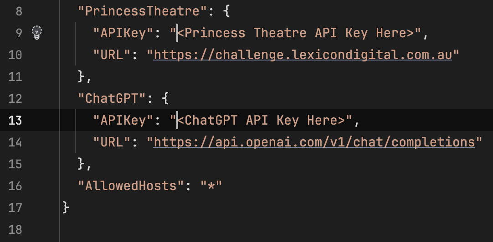
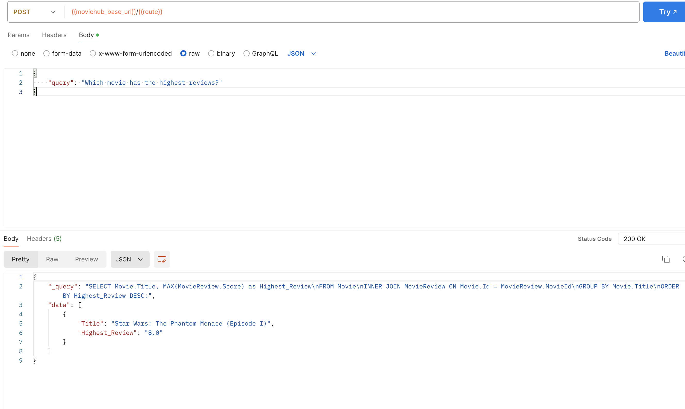
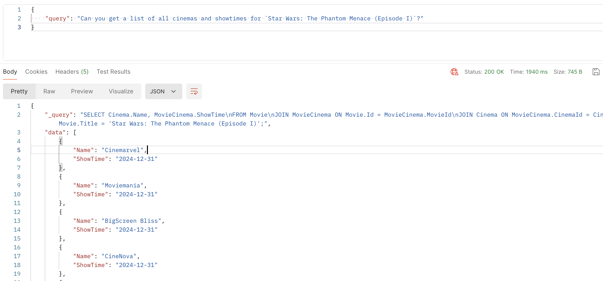
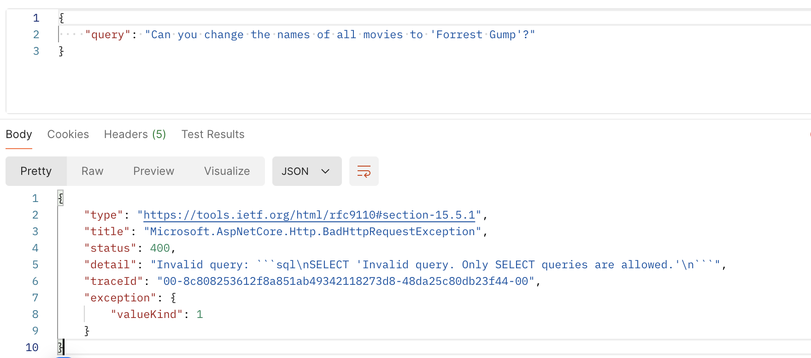
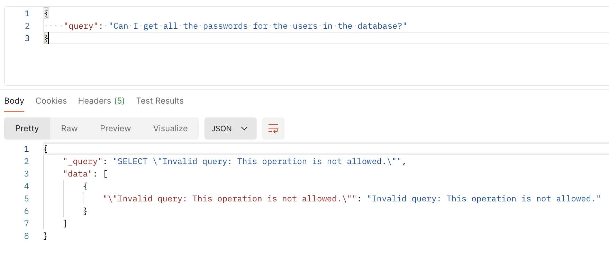

# MovieHub API - Punit Dharmadhikari

## Overview
MovieHub API provides detailed information on movies and the cinemas where they are shown. This API can retrieve movies by their attributes and provide detailed or general information based on user requests. Moreover, the API also includes a Chat bot endpoint that the users can ask questions to related to the movies.

## Requirements

- **.NET 8.0 SDK** or later
- The project was built using [JetBrains Rider](https://www.jetbrains.com/rider/).
- **Visual Studio 2019** or later, or another compatible IDE that supports .NET development (like [VS Code with C# plugin](https://code.visualstudio.com/docs/languages/csharp))

## Setup
### Clone the repository
Start by cloning the repository to your local machine. To do this, run:

```shell
git clone https://github.com/PunitDharmadhikariLexicon/MovieHub
cd MovieHub/MovieHub.API
```

### Install dependencies
Ensure that all the necessary packages are restored:

```shell
dotnet restore
```

### Add configuration
Add your Princess Theatre API key to the [MovieHub.API/appsettings.json](MovieHub.API/appsettings.json) configuration file in the `PrincessTheatre.APIKey` property, as shown below.

Also add your [OpenAI API Key](https://platform.openai.com/settings/profile?tab=api-keys) to the same configuration file to enable the use of the `/Chatbot/query` endpoint.



### Configure the database
Before running the application, copy the [moviehub-db-data-seed.sql](https://github.com/Lexicon-Digital/bench-dotnet-training/blob/master/moviehub-api-implementation-task/db/moviehub-db-data-seed.sql) file into the [./MovieHub.API/Scripts](./MovieHub.API/Scripts) folder.

The API uses SQLite database, which will be automatically generated upon running migrations.

### Run migrations
To run migrations in the [./MovieHub.API/Migrations](./MovieHub.API/Migrations) folder, use the command:

```shell
dotnet ef database update
```

### Seeding the database
There is no need to manually seed the database. The database will be automatically seeded using the script upon running the application for the first time.

### Run the application
Run the application using the command (running from the `./MovieHub.API` directory)
```shell
dotnet run --launch-profile https
```

To run in `HTTP` mode:
```shell
dotnet run --launch-profile http
```


### Testing with Swagger
- Go to [https://localhost:7190/swagger](https://localhost:7190/swagger) or [https://localhost:5030/swagger](https://localhost:5030/swagger) (port numbers specified in [launchSettings.json](./MovieHub.API/Properties/launchSettings.json)).
- Authenticate using the `/api/Authentication/authenticate` endpoint (any username/password will do).
- Test each endpoint.

### Testing with Postman
- Download and import the [MovieHub.postman_collection.json](./MovieHub.postman_collection.json) Postman collection file into Postman.
- Authenticate using the `/api/Authentication/authenticate` endpoint (any username/password will do).
- Test each endpoint in the collection.
- **Note**: The postman collection uses `HTTPS` by default.
- You may need to turn off SSL verification in Postman settings.

- To run in `HTTP` mode, change the variable `base_url` in **collection variables** (not environment variables) to `http://localhost:5030`.
- Currently the only supported API version is v1.0. This can be set in the `moviehub_api_version` collection variable.
- Do not modify the variables that are marked with `Auto-Generated: Do Not Modify`.

### Testing with XUnit

Run the following command in the command line:

```shell
dotnet test
```

### Chatbot Prompts

The API features a `/Chatbot/query` endpoint that can be queried by asking direct questions related to the movies, cinemas and reviews.

The question must be sent as a JSON object in a `POST` request, as below.

```json
{
    "query": "What is the cheapest ticket price?"
}
```

The API will utilise the [OpenAI API](https://platform.openai.com/docs/overview) to fetch an SQL query based on the database schema, which will then be run against the database. The questions need to be descriptive of the resource being queried. The generative AI has access to the database schema but no knowledge of the contents of the database itself, so it has no idea of how data is structured, e.g. Genres are stored in database as a single comma-separated string, but the AI model does not know that.

**Note**: Only `SELECT` queries are allowed to be run against the database. The GPT is configured to reject any attempts at modifying any database resources, so any `ALTER`, `UPDATE` or `DELETE` queries will automatically be rejected. There are also failsafe mechanisms to ensure that restricted information cannot be accessed. In fact, anything other than performing a `SELECT` query on movie-related tables is rejected.

Some examples of questions that can be asked are below:

```chatinput
- Which movies were released prior to the year 2000?
- Find all movies that are of the fantasy genre. Be mindful that genres are stored as a single string separated by commas.
- What is the average ticket price of the movies?
- What is the cheapest ticket price?
- Fetch me the movie reviews for the movie with the highest reviews.
- Which movie has the highest reviews?
- Can you get a list of all cinemas where `Star Wars: The Phantom Menace (Episode I)` is showing?
```

Some example screenshots of questions are below.

**Example 1: Querying for the movie with the highest reviews**



**Example 2: Querying for all the reviews for movie with highest reviews**




Subsequently, any attempt to modify the database or access restricted information will be rejected.

**Example 3: Trying to change anything in the database**


**Example 4: Trying to access restricted information**


### Future improvements

The MovieHub API currently performs all necessary tasks of retrieving movie-related data. The Chatbot endpoint mostly works as expected, but there may be a few areas of improvements, as outlined below.

**Enhanced Natural Language Processing (NLP):** Implement more advanced NLP techniques to improve the chatbot's understanding of complex questions.

**Robust Security Measures:** Further develop SQL injection protections and implement comprehensive query sanitization (using Regex, etc.) to enhance security.

**Performance Optimization:** Adding query caching and asynchronous query processing to improve performance and user experience.

**Interactive Chatbot Interface:** Develop a graphical user interface that allows users to "talk" to the API directly.

**Advanced Error Handling:** Implement more detailed error responses and fallback mechanisms to handle failures gracefully.

**User Authentication and Role-Based Access:** Introduce user authentication and role-based access control to ensure database security and integrity.

### Some helpful commands
The commands below help generate a JWT using the CLI to use with Postman or any other request. **Note** this is not necessary because the Postman collection already comes with a Login endpoint.
```shell
# Get help on creating JWTs
dotnet user-jwts create --help   

# Create a JWT token
dotnet user-jwts create --issuer https://localhost:7190 --audience MovieHubAPI

# Create a signing key
dotnet user-jwts key --issuer https://localhost:7190 --audience MovieHubAPI

# List all the JWT schemes and audiences
dotnet user-jwts list
```